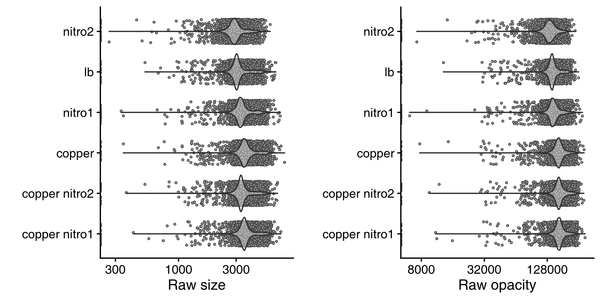
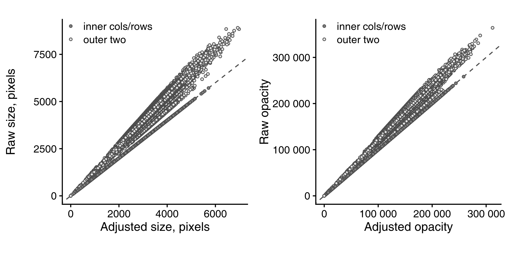
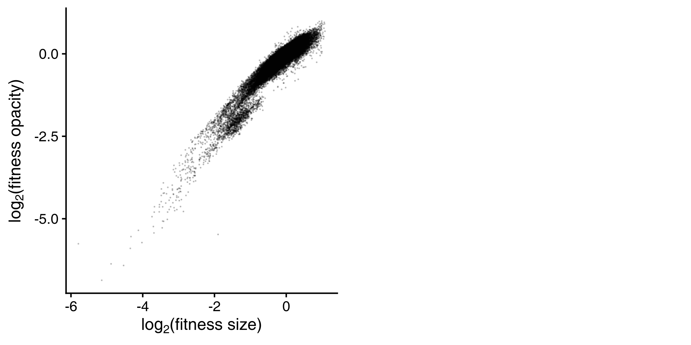
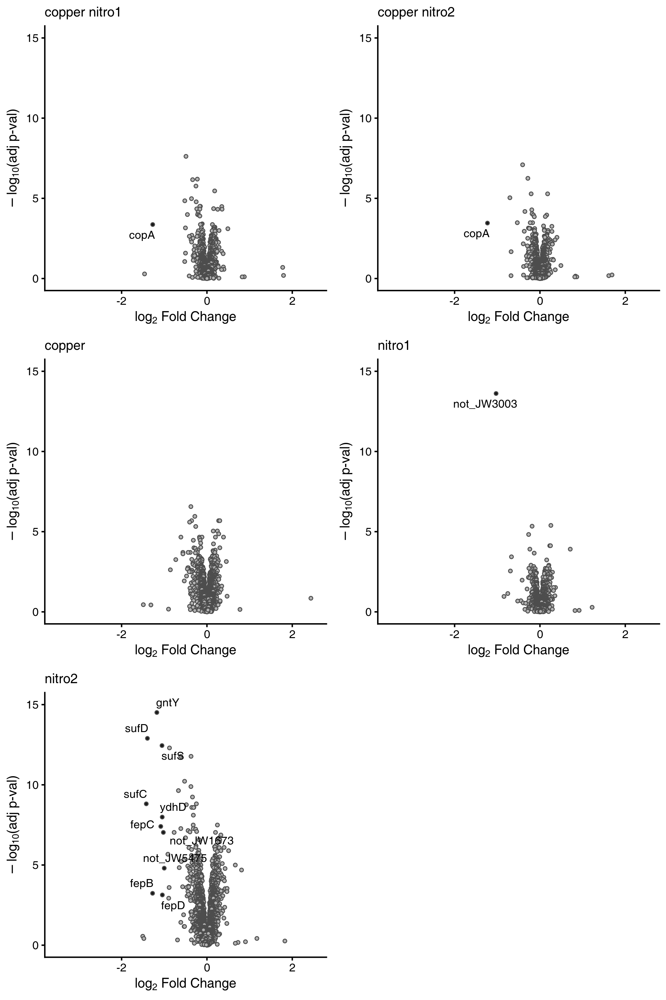
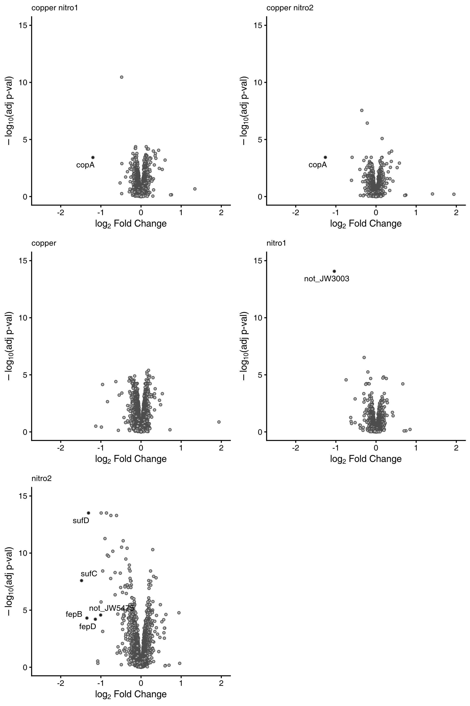

-   [Introduction](#introduction)
-   [Look at raw data](#look-at-raw-data)
-   [Data analysis](#data-analysis)
-   [Step 1 | Adjust outer rows/cols](#step-1-adjust-outer-rowscols)
-   [Step 2 | Calculate fitness](#step-2-calculate-fitness)
-   [Step 3 | Change per condition](#step-3-change-per-condition)
    -   [Opacity](#opacity)
    -   [Size](#size)
-   [Which conditions are similar](#which-conditions-are-similar)

# Introduction

Analysis for nitroxoline chemical genetics [*Cacace et al
2025*](https://www.biorxiv.org/content/10.1101/2024.06.04.597298v1).

# Look at raw data

The effect of the conditions (compared to LB) was small.

# Data analysis

Working in parallel with both opacity (which we prefer) and colony size:

1.  Bring the median of two outermost columns/rows multiplicatively to
    plate median
2.  Calculate the mutant fitness as a fraction of the plate median
3.  Estimate the multiplicative change in mutant fitness per condition
    using empirical Bayes’ moderated T-test

# Step 1 | Adjust outer rows/cols

As the adjustment was multiplicative, larger deviations from plate
median appear corrected “more strongly” in linear scale, i.e. were
y-axis in log scale, dark and light grey points would be parallel.

# Step 2 | Calculate fitness

There’s some interesting subset with lower opacity and bigger size than
on average.

# Step 3 | Change per condition

In the following, names are given to genes of mutants with more than
2-fold and significantly changed fitness.

One could speculate that the stronger effect of a drug, as for nitro2 vs
nitro1 was beneficial to elucidate the phenotype.

## Opacity

Find the results for each condition as a csv file [here](output/csv).

## Size

# Which conditions are similar

Representation of condition similarity using hierarchical clustering.

